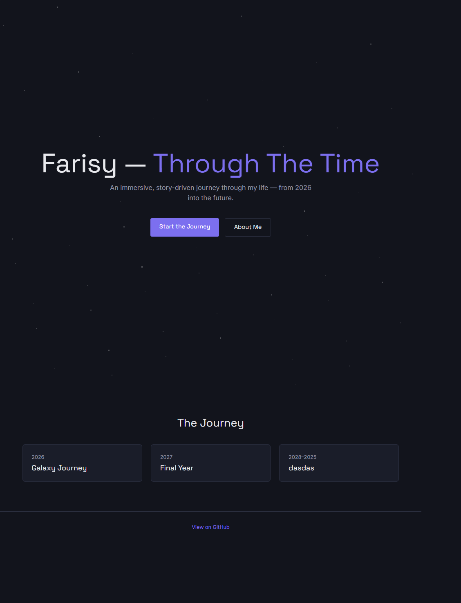
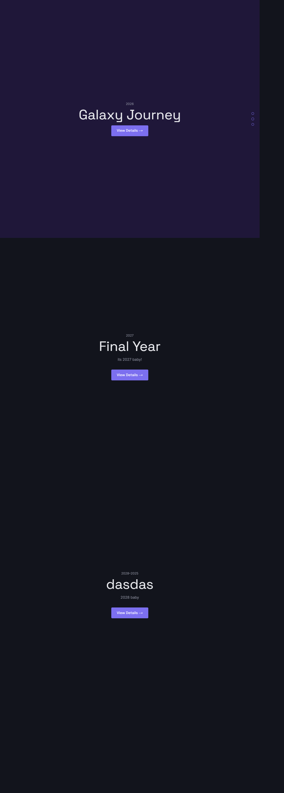
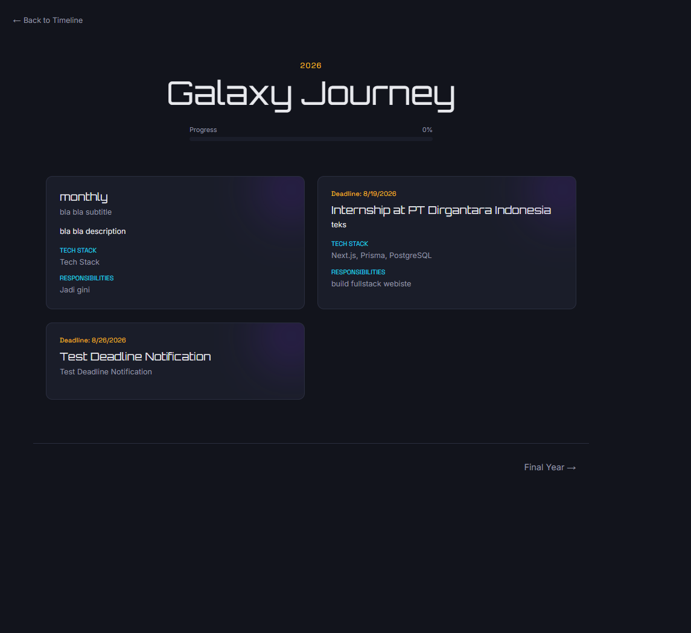
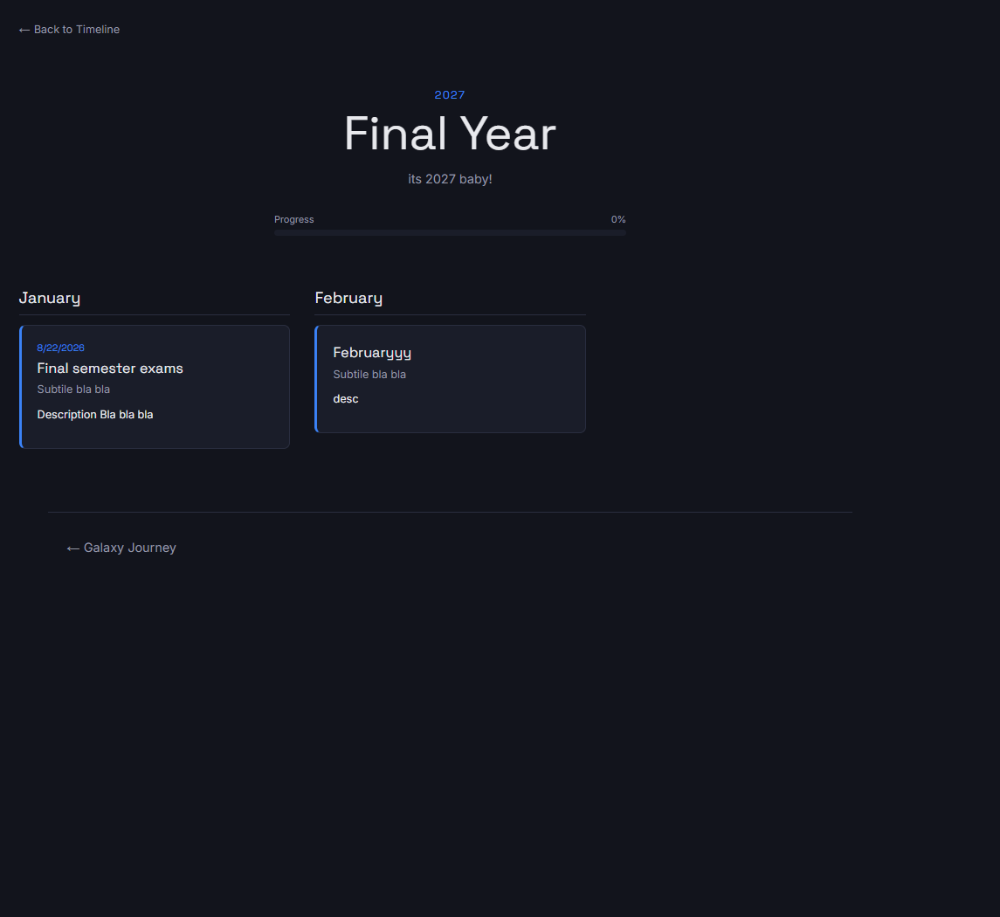
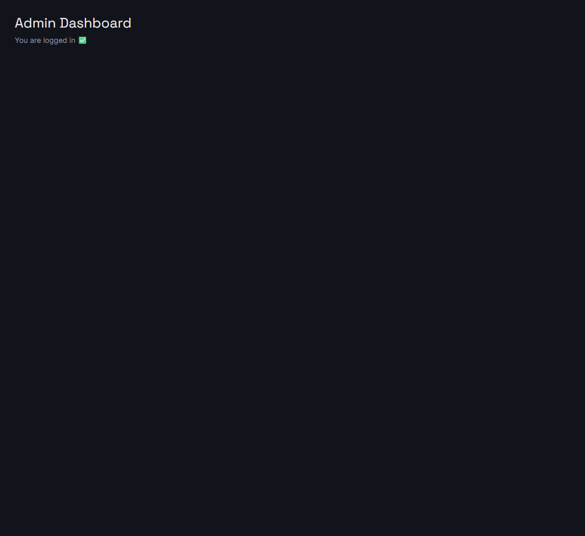

# Life Plan — Through The Time

> An immersive, story-driven personal Life Journey web application documenting a life timeline from 2026 into the future, with a full CMS backend for content management.

🔗 **Live Demo:** _coming soon_
📖 **Documentation:** This README

---

## Overview

**Life Plan** is a full-stack personal portfolio/life-journey application built as both a real planning tool and a technical showcase. Each era of life (2026–2033+) is represented through a distinct visual theme — Galaxy, Monthly, Racing, Voyage, and Tree — rendered dynamically from a flexible content model, with a full admin CMS behind it.

This is **not a conventional portfolio site** — it's designed to feel like an immersive, narrative-based application.

## Screenshots

| Home                                 | Timeline Overview                            |
| ------------------------------------ | -------------------------------------------- |
|  |  |

| Year Detail (Galaxy Theme)               | Year Detail (Monthly Theme)                |
| ---------------------------------------- | ------------------------------------------ |
|  |  |

| Admin Dashboard                        |
| -------------------------------------- |
|  |

## Tech Stack

**Core**

- [Next.js 16](https://nextjs.org/) — App Router, TypeScript
- [Prisma 7](https://www.prisma.io/) — ORM with `@prisma/adapter-pg` driver adapter
- [Neon](https://neon.tech/) — Serverless PostgreSQL

**Auth**

- [NextAuth.js v5](https://authjs.dev/) — Credentials Provider, JWT sessions
- `bcryptjs` for password hashing

**UI & Animation**

- [Tailwind CSS v4](https://tailwindcss.com/) — CSS-based theming via `@theme`
- [Framer Motion](https://www.framer.com/motion/) — component-level animation
- [GSAP](https://gsap.com/) + ScrollTrigger — scroll-based storytelling
- [Lenis](https://lenis.darkroom.engineering/) — smooth scrolling
- [Lucide React](https://lucide.dev/) — icons

**Validation**

- [Zod v4](https://zod.dev/) — schema validation on all forms

## Architecture Highlights

- **Flexible content model** — a single `ContentBlock` model with a `type` + JSON `data` field renders completely different UI per era theme (`<CardGalaxyTheme />`, `<CardMonthlyTheme />`, etc.), keeping the backend schema stable while the frontend stays fully custom per year.
- **Edge-safe auth split** — `auth.config.ts` (no Node dependencies) powers route-protection middleware/proxy on the Edge runtime, while `auth.ts` (with Prisma) handles full authentication logic on the Node runtime.
- **Activity logging** — every admin CRUD action is recorded with actor, action, entity, and a JSON detail snapshot.
- **Deadline notifications** — a cron-triggered endpoint scans `ContentBlock.deadline` and generates `DEADLINE_7D/3D/1D` notifications automatically, avoiding duplicates.
- **SEO-first** — dynamic per-page metadata generated from the database, auto-generated `sitemap.xml` and `robots.txt`, and JSON-LD Person schema.

## Project Structure

src/
├── app/
│ ├── (public)/ # Public-facing routes
│ ├── admin/ # Admin CMS (protected)
│ ├── api/ # API routes (auth, cron)
│ ├── timeline/ # Timeline overview + [slug] year detail
│ └── about/ # About Me page
├── components/ # Shared UI components
├── lib/
│ ├── actions/ # Server actions (CRUD)
│ ├── validations/ # Zod schemas
│ └── prisma.ts # Prisma client singleton
└── proxy.ts # Edge middleware (route protection)
prisma/
├── schema.prisma
└── seed.ts

## Getting Started

```bash
# Install dependencies
npm install

# Set up environment variables
cp .env.example .env
# Fill in DATABASE_URL, AUTH_SECRET, etc.

# Run database migrations
npx prisma migrate dev

# Seed an admin user
npx tsx prisma/seed.ts

# Start the dev server
npm run dev
```

## License

All Rights Reserved.

This repository is public for showcase purposes only. No pull requests, forks for redistribution, or reuse of code are permitted without explicit permission from the author.

---

Built with ❤️ by [Farisy Syarif](https://github.com/FarisyIlman)
